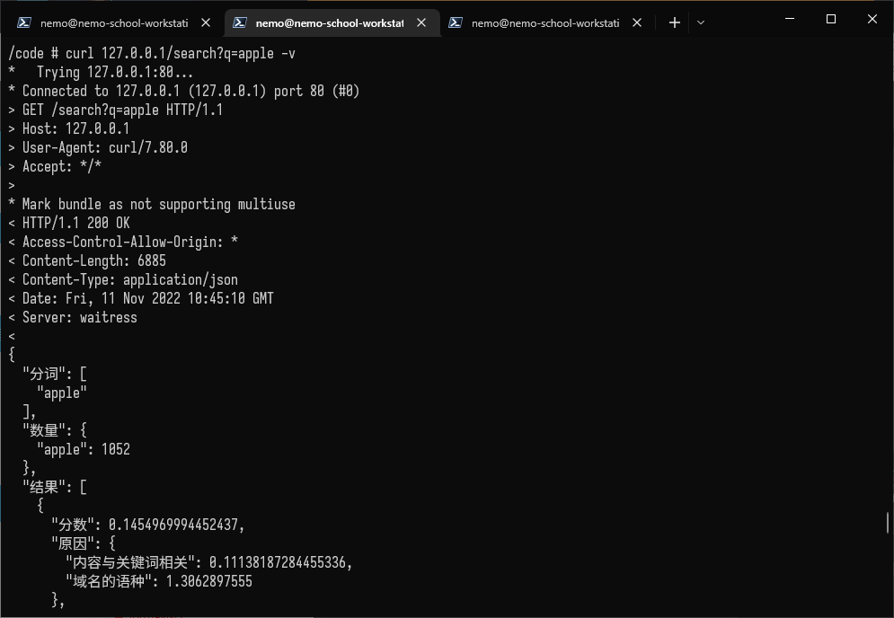

# sese-engine-docker

Docker scripts and compose for sese-engine (https://github.com/RimoChan/sese-engine)

现在最新刀客镜像版本是 `anzupop/sese-engine:multiarch`

## 如何使用？

```bash
docker-compose up
```

## 开发

* 编译时为了能有轮子而不是从头编译，把 `orjson` 的包依赖改成了当前版本；然后把用不到的看堆内存的东西丢掉了。

### 编译并推送到刀客集线器

```bash
make all
```

### 重新编译镜像

```bash
make clean && make build
```

## 总之这里是截图




