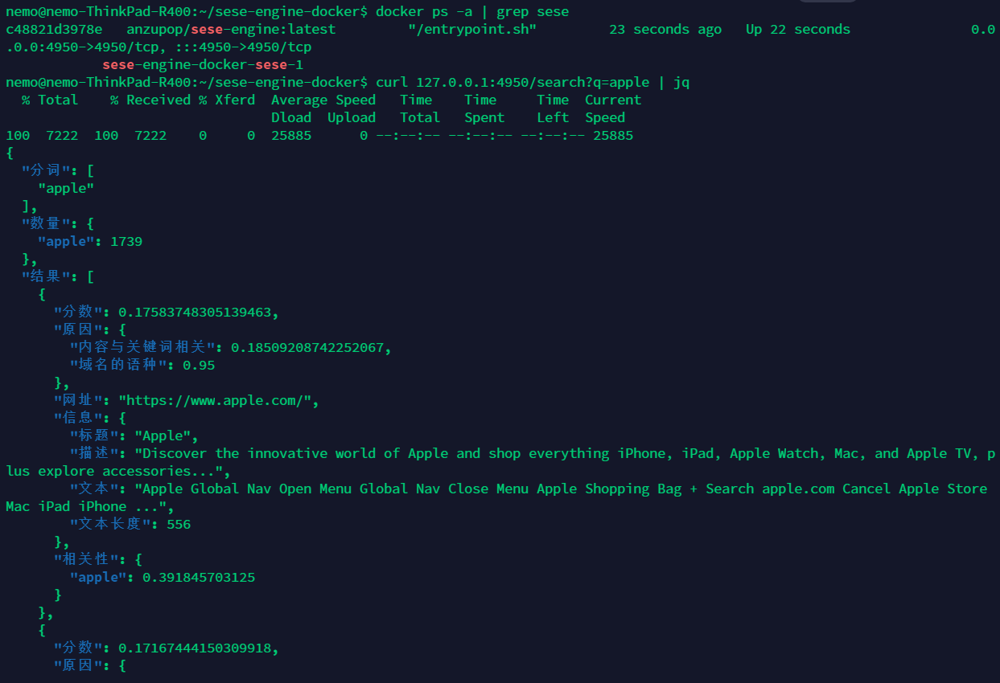

# sese-engine-docker

Docker scripts and compose for sese-engine (https://github.com/RimoChan/sese-engine)

## 如何使用？

```bash
docker-compose up
```

## 编译并推送到刀客集线器

```bash
make all
```

## 重新编译镜像

```bash
make clean && make build
```

## 这里是截图

